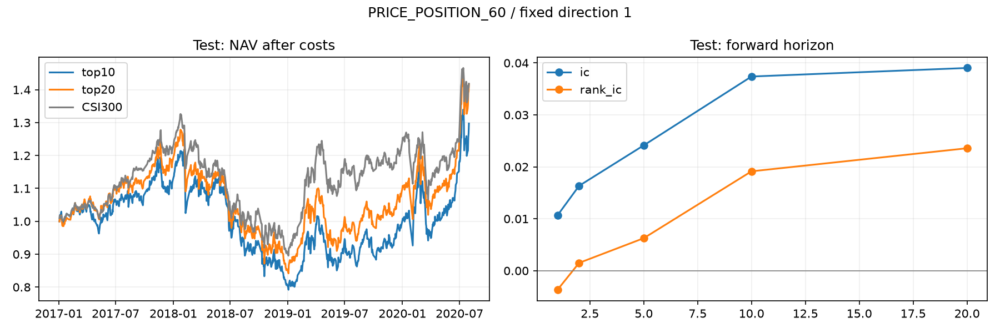

# PRICE_POSITION_60 / M1 因子报告

研究状态：**REJECT**。依据：`validation_gate:rank_ic, validation_gate:positive_rank_ic_ratio, validation_gate:net_excess_annual`。

表达式：`(close - Min(low,60)) / (Max(high,60) - Min(low,60))`；预先固定方向：+1；族：price_position。
假设：接近60日高位的股票有收益延续性。

正向分数代表更看好。方向在运行前指定，未根据验证或测试结果翻转。

## 预测能力与覆盖

| 样本 | IC | ICIR | RankIC | RankICIR | RankIC为正比例 | 因子覆盖 | 有效IC天数 |
|---|---:|---:|---:|---:|---:|---:|---:|
| train | -0.0147 | -0.0717 | -0.0285 | -0.1340 | 45.10% | 55.27% | 1603 |
| valid | -0.0464 | -0.2370 | -0.0627 | -0.3152 | 39.08% | 78.99% | 476 |
| test | 0.0241 | 0.1296 | 0.0063 | 0.0317 | 51.56% | 92.53% | 865 |

主标签为5个交易日持有期：close[t+1+5]/close[t+1]-1。ICIR未年化；IC为各交易日横截面相关性的平均值。
覆盖率为可用因子股票日数/历史成分股票日数。停牌、预热不足和缺价不填充。标签进出端点排除停牌及按本次9.5%限制不能成交的日期；涨跌停日的可观测因子分数仍保留。各持有期按对应集合结束日剔除越界标签，因此长周期有效样本更少。

## 衰减（测试集）

| 持有期 | IC | RankIC | ICIR | 天数 | 最后可用信号日 |
|---|---:|---:|---:|---:|---|
| 1日 | 0.0107 | -0.0037 | 0.0552 | 869 | 2020-07-29 00:00:00 |
| 2日 | 0.0163 | 0.0015 | 0.0838 | 868 | 2020-07-28 00:00:00 |
| 5日 | 0.0241 | 0.0063 | 0.1296 | 865 | 2020-07-23 00:00:00 |
| 10日 | 0.0374 | 0.0191 | 0.2143 | 860 | 2020-07-16 00:00:00 |
| 20日 | 0.0390 | 0.0236 | 0.2401 | 850 | 2020-07-02 00:00:00 |

这里是不同持有期的预测表现，不是改变因子滞后后的半衰期估计。

## 稳定性（测试集）

| 分组 | RankIC | RankICIR | 有效天数 |
|---|---:|---:|---:|
| 2017 | 0.0201 | 0.0928 | 244 |
| 2018 | 0.0106 | 0.0502 | 243 |
| 2019 | -0.0171 | -0.0969 | 244 |
| 2020 | 0.0156 | 0.0945 | 134 |
| bull | -0.0220 | -0.1084 | 269 |
| bear | -0.0012 | -0.0064 | 196 |
| sideways | 0.0290 | 0.1496 | 400 |

市场状态使用信号日已知的沪深300过去60日涨跌幅：>5%为bull、<-5%为bear，其余为sideways。多日标签重叠，未把这些观察当作独立样本做显著性或多重检验结论。

## 暴露与独立性（验证集）

| 暴露 | 日均秩相关 | 状态 |
|---|---:|---|
| size | 缺失 | MISSING_DATA |
| industry | 缺失 | MISSING_DATA |
| volatility | 0.1647 | AVAILABLE |
| turnover | 0.0622 | AVAILABLE |

size/industry缺少封存的历史时点数据，未使用当前行业或市值替代。volatility对应20日收益波动，turnover对应20日平均换手率。
候选批次最大绝对相关：0.6771；已有KEEP池最大绝对相关：缺失。均为验证期每日横截面Spearman相关的均值。空池记缺失。

## 组合测试

| 样本/组合 | 毛累计收益 | 净累计收益 | 净复利年化 | 净值最大回撤 | 净超额年化 | 超额IR | 日均双边换手 | 年化成本拖累 |
|---|---:|---:|---:|---:|---:|---:|---:|---:|---:|
| valid/top10 | -52.16% | -62.30% | -37.86% | -69.39% | -45.00% | -3.0683 | 48.90% | 11.62% |
| valid/top20 | -33.36% | -43.17% | -24.09% | -59.44% | -24.71% | -2.0684 | 32.73% | 7.77% |
| test/top10 | 105.30% | 29.74% | 7.37% | -34.99% | -1.69% | -0.1321 | 52.75% | 12.55% |
| test/top20 | 83.51% | 41.68% | 9.99% | -34.17% | 0.49% | 0.0500 | 29.77% | 7.08% |

top10/top20目标持仓为30/60只，每日允许替换全部排名退出的股票，实际成交与持仓由Qlib执行。沿用M0收盘成交、9.5%涨跌限制、买入0.05%/卖出0.15%及最低5元成本，初始资金1亿元。未加入冲击成本、融券或容量模型。
年化均使用238日。超额收益为每日收益之差的算术年化；复利年化来自净值。M1回撤包含初始净值1和初始累计超额0，M0默认回撤的起点处理有所不同。
另保存假想top20%-bottom20%多空标签差：测试期平均5日价差为0.29%。它不模拟融券、费用或连续持仓，未换算成可交易净收益或年化收益。分组先按当天分数确定，缺失标签数量保存在CSV中。

## 判定与复现

仅验证集参与研究状态判定：覆盖≥70%、有效IC≥100天、RankIC≥0.01、正RankIC比例≥50%、top20含成本超额年化>0。与已有KEEP池绝对相关≥0.90则淘汰；通过收益门槛但缺少必要暴露/池对照则FORWARD。KEEP只表示研究池候选。
运行PASS表示管线验收通过；REJECT表示该预设方向未通过研究规则。失败试验保留在SQLite，不把测试集结果用于修改方向或门槛。
BaoStock历史成分与复权使用当前下载的历史快照；代码时序检查通过不能证明供应商历史从未修订。
运行ID：`20260903T064735970067Z`；因子ID：`F_27cc61aeae60181f`。完整定义、指标与原因见同目录`report.json`。

