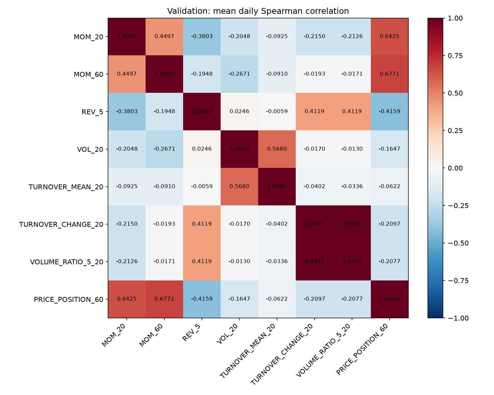

# M1 Factor Research Engine

完成8个因子评估；执行失败0个。使用封存BaoStock历史沪深300数据，固定训练2008–2014、验证2015–2016、测试2017–2020年7月。

| 因子 | 方向 | 验证RankIC | 验证净超额年化 | 测试RankIC | 测试净超额年化 | 测试净值回撤 | 研究状态 |
|---|---:|---:|---:|---:|---:|---:|---|
| [MOM_20](MOM_20/report.md) | +1 | -0.0757 | -25.92% | -0.0173 | -8.33% | -44.50% | REJECT |
| [MOM_60](MOM_60/report.md) | +1 | -0.0820 | -27.34% | -0.0016 | -0.03% | -35.80% | REJECT |
| [REV_5](REV_5/report.md) | +1 | 0.0570 | 0.66% | 0.0221 | -17.55% | -47.56% | FORWARD |
| [VOL_20](VOL_20/report.md) | -1 | 0.0550 | 11.42% | 0.0152 | -13.93% | -34.91% | FORWARD |
| [TURNOVER_MEAN_20](TURNOVER_MEAN_20/report.md) | -1 | 0.0438 | 10.61% | 0.0325 | -6.44% | -26.58% | FORWARD |
| [TURNOVER_CHANGE_20](TURNOVER_CHANGE_20/report.md) | -1 | 0.0106 | -9.57% | -0.0008 | -17.07% | -45.77% | REJECT |
| [VOLUME_RATIO_5_20](VOLUME_RATIO_5_20/report.md) | -1 | 0.0111 | -10.05% | -0.0002 | -17.01% | -45.64% | REJECT |
| [PRICE_POSITION_60](PRICE_POSITION_60/report.md) | +1 | -0.0627 | -24.71% | 0.0063 | 0.49% | -34.17% | REJECT |

组合列统一使用top20（目标60只）的含成本结果；RankIC使用预先固定方向和5日主标签。完整报告包含1/2/5/10/20日衰减、年份/市场状态稳定性、暴露、相关性、top10/top20回测及假想多空标签差。

研究状态由验证集硬规则决定。所有正负结果和失败试验保存在`data/factor_registry.sqlite`。行业/市值缺失为null；通过验证但这些检查未完成的候选为FORWARD。测试集多次研究后只能视为诊断样本，不能视为未触碰的最终留出集。

年化采用238日；超额为算术口径，账户收益与回撤为净值口径。多日标签重叠，表中无显著性或多重试验校正后的优胜结论。M0 Top50/drop5模型基线与本次单因子top30/60日度排名组合用途不同。

## 验证集候选相关性



## 复跑

```powershell
Set-Location 'F:\workspace\finance\quant-research-os'
.\run-factors.ps1
```

单因子：`.\run-factors.ps1 -Factor MOM_20`。新试验写入独立目录，已有试验不会覆盖。

接口示例（项目根目录，Python配置`PYTHONPATH=src`）：

```python
from quant_research.factors.engine import evaluate_factor
report = evaluate_factor("MOM_20", universe="csi300", horizon=5)
print(report.status, report.artifact_directory)
```

M0永久ID：`BL-CN-CSI300-A158-LGBM-001`；原始源码和产物校验和在`baselines/`。每次M1运行前后验证原基线未改动。

数据时点检查不等于证明供应商历史未被事后修订。M2的Alpha158解剖、基本面、行业中性化和边际贡献尚未纳入本阶段。

执行依据：[Qlib组合策略文档](https://qlib.readthedocs.io/en/latest/component/strategy.html)。

## 本次验收

运行状态PASS、进程退出码0，122项测试通过。独立核对3,360个日度RankIC样本、45,915个原始行情标签值（3只股票的全区间/持有期）、21,744个组合日记录，以及SQLite、源码和数据身份。结果见[final_verification.json](final_verification.json)，可用同目录`verify_outputs.py`重验。

5个REJECT、3个FORWARD、0个KEEP。FORWARD仅表示验证集门槛通过；这3个因子在测试期的含成本超额收益均为负，且缺少行业/市值和已有因子池核验。

前两轮共16条失败/中断记录保留在SQLite。最终采用单进程Qlib读取，避开本机Windows子进程中Polars的`sse3`初始化错误；研究公式、成本和样本分割不变。
