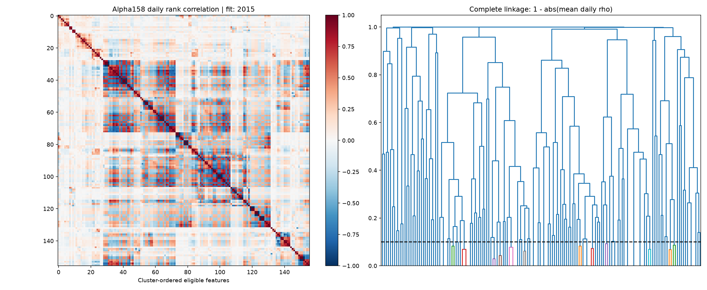

# M2.1 Alpha158解剖与技术参照

已提取固定Qlib版本的158项原始表达式。2015用于无监督聚类，2016仅作已观察历史诊断。
90%覆盖率及100个有效相关日门槛后，156项进入聚类，得到123个技术代表。
代表按簇内平均绝对相关选取，不按IC或收益挑选；原公式方向不翻转。代表集不等于KEEP池或独立Alpha数量。

|经济描述族|特征数|
|---|---:|
|candlestick|9|
|intraday_price_ratio|4|
|price_position|45|
|price_volume|15|
|trend_reversal|55|
|volatility|5|
|volume_dynamics|25|

## BP条件信号：2016同样本比较
投影前RankIC：0.035482477367675534；投影后RankIC：0.016669925516507297。
共同覆盖率：75.51%；状态：DIAGNOSTIC_ONLY。
投影平均解释比例：0.25054314656941407。
技术代表经仅在2015拟合的PCA压缩至20维，训练方差保留77.72%。
投影同时控制技术主成分、行业与流通市值代理。不同缺失范围不能混比；残差可能含未保留的技术信息。
这是条件预测诊断，没有进行新的组合回测或LightGBM重训；不升级BP状态。

## 结论边界与下一步
单特征IC仅用于描述，没有在158项中按最优结果选方向/窗口，未作显著Alpha发现声明。
月度行业、流通市值代理及供应商修订未知限制继承自首轮。
无定义或相关日不足的配对在原矩阵保留缺失，仅在聚类距离中按最大距离处理。
下一项：历史CSI300季度财务与有限经济因子族，之后进行滚动Alpha158+LightGBM add/drop。
2021–2023资格样本和2024–2025锁箱均未访问。
